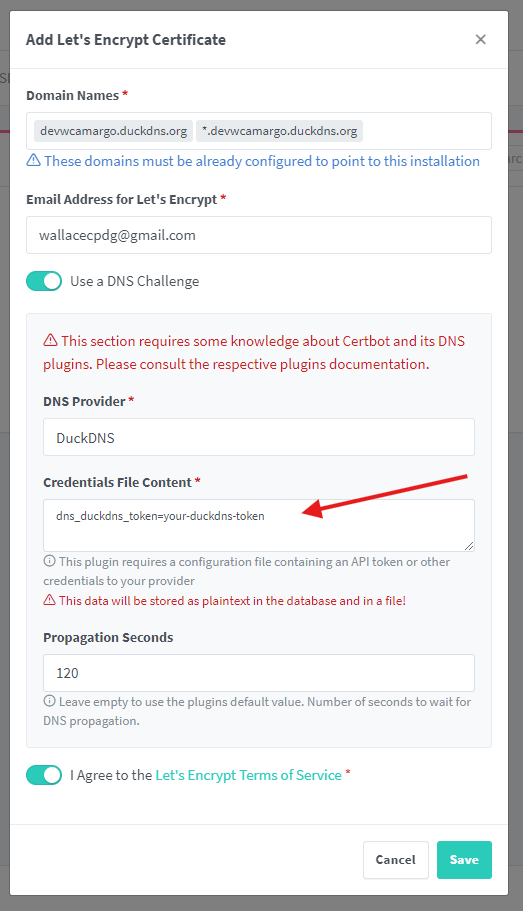

# Nginx Proxy Manager

## Acess Service
http://127.0.0.1:81

## Login
Email:    admin@example.com

Password: changeme

## Para Criar um DNS Free
https://www.duckdns.org/

## Gerar um certificado com Lets Encrypt

- Adicione o domínio criado e depois adiciona .* com o domínio novamente.

Exemplo:

devwcamargo.duckdns.org *.devwcamargo.duckdns.org

- DNS Provider = DuckDNS

- Cole o token gerado pelo DuckDNS no lugar indicado.

